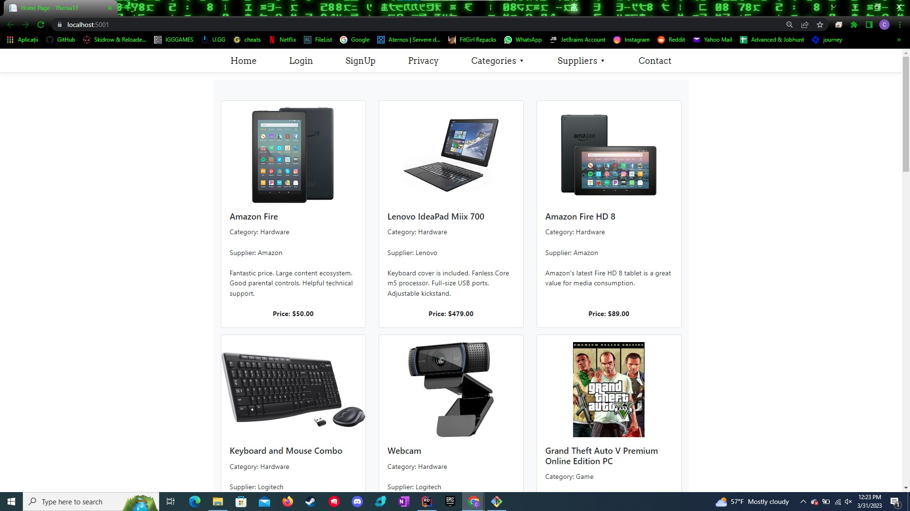
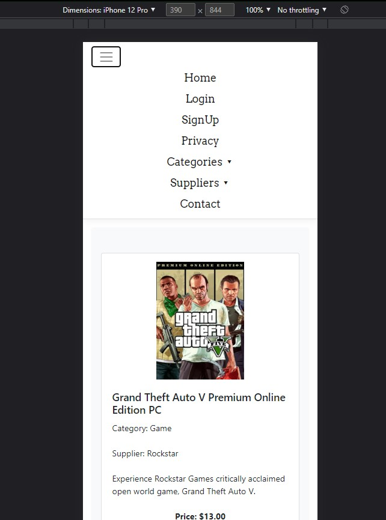
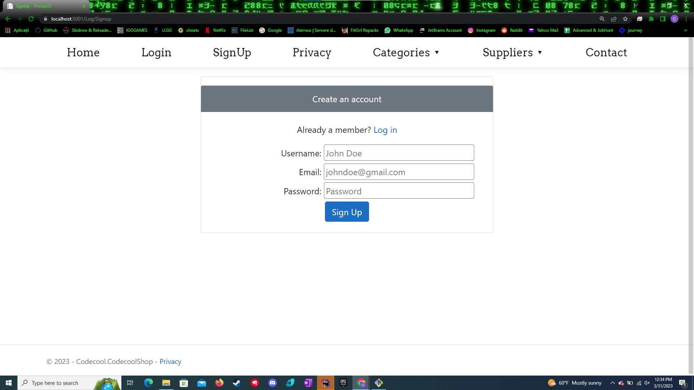
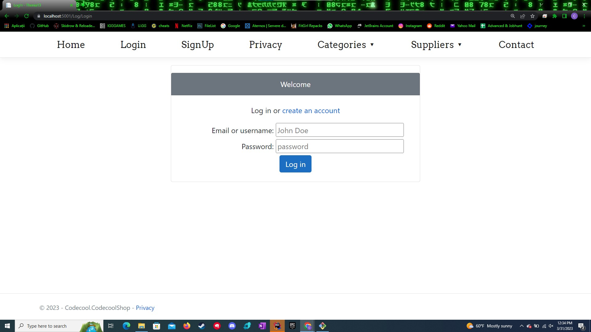
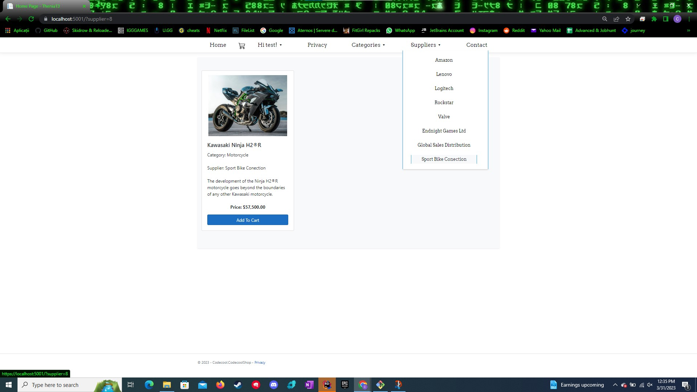
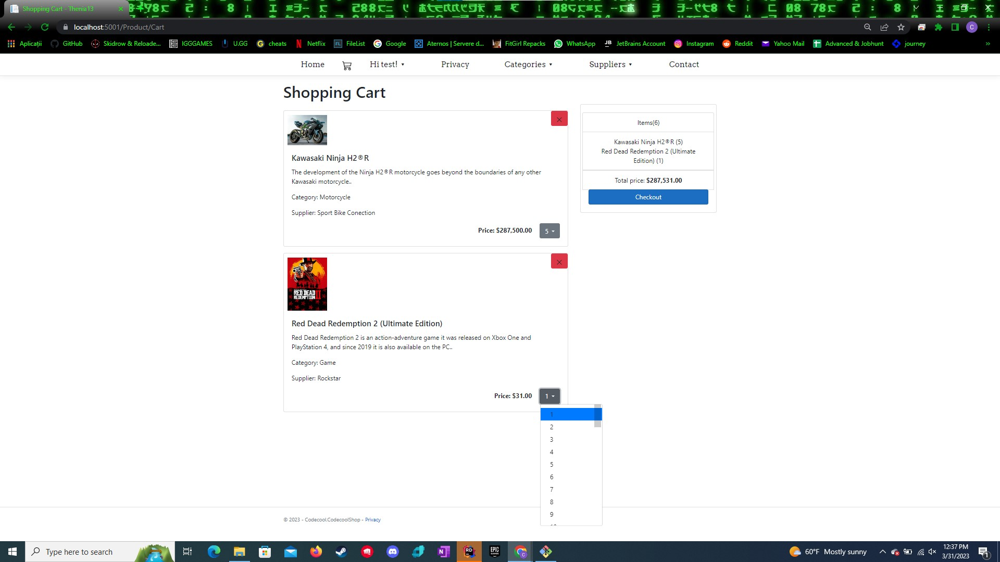
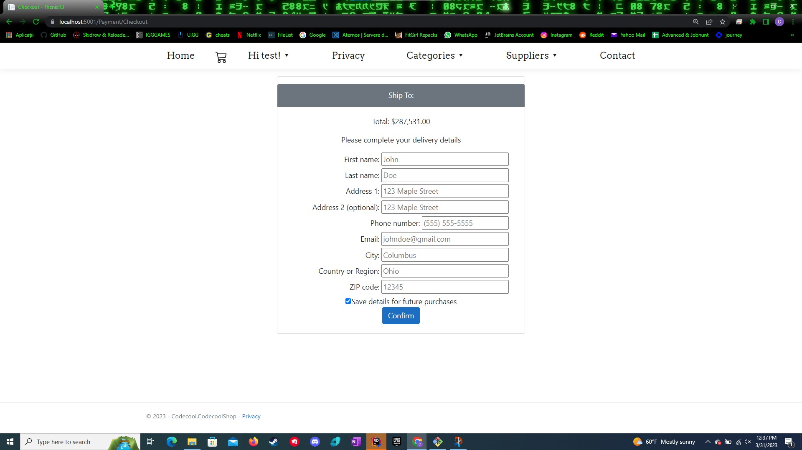
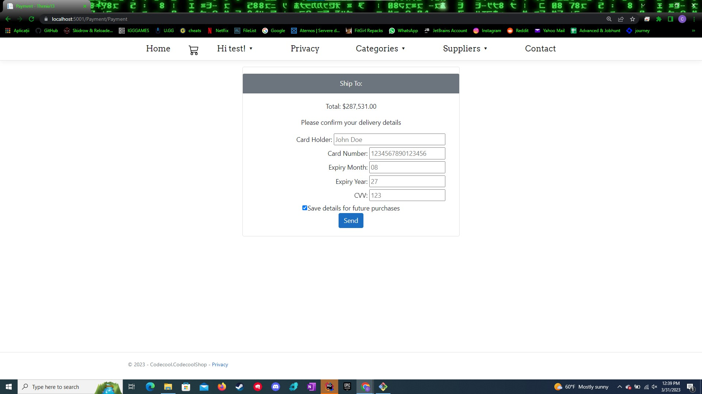
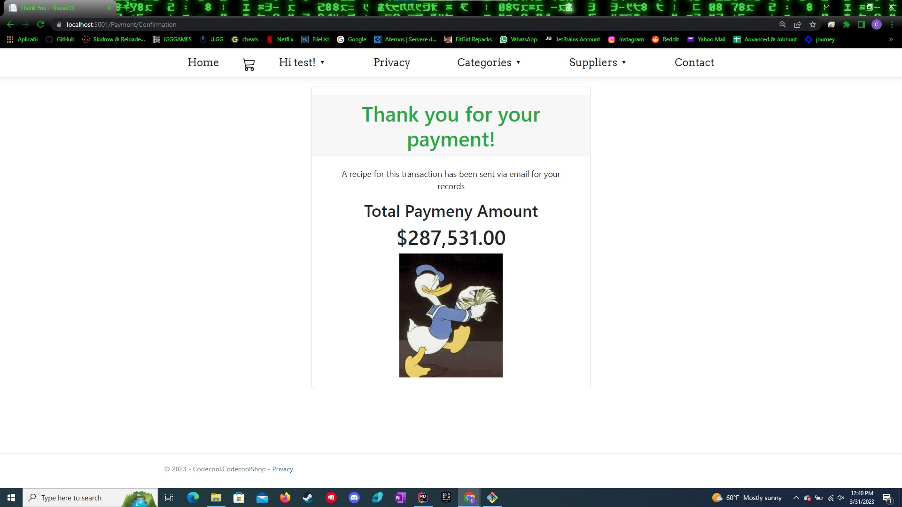

## CodecoolShop

### About the Project:

- Welcome to CodecoolShop, an online shopping platform where you can find a wide range of tech and gaming products. Our website has been developed using the latest front-end technologies, such as Razor Pages, JavaScript, Bootstrap, HTML, and CSS, and in the back-end, we use C#, ASP.NET CORE Framework, and MicrosoftSQL Server. We offer payment via debit or credit cards with payment validation to ensure a secure transaction process.

- Our platform offers a user-friendly interface that makes it easy for you to browse and purchase products such as laptops, gaming accessories, keyboards, and video games. You can create an account and start adding items to your cart.

- We have implemented a delivery validation system to ensure that your items are shipped to the correct address. We also offer the option to save your delivery and payment details for future purchases, making the checkout process even quicker and easier.

- After you have placed your order, we send you a confirmation to ensure that the order was successfully placed. You can also view your order history on our platform, making it easy for you to keep track of your purchases.

- At CodecoolShop, we value feedback from our customers, and we continuously work to improve our platform to provide you with the best shopping experience. Thank you for choosing CodecoolShop for your needs.

### Used technologies:
#### Backend technologies:
1. [C#](https://learn.microsoft.com/en-us/dotnet/csharp/)
2. [ASP.NET CORE Framework](https://learn.microsoft.com/en-us/aspnet/core/introduction-to-aspnet-core?view=aspnetcore-7.0)
3. [MicrosoftSQL Server](https://learn.microsoft.com/en-us/sql/sql-server/?view=sql-server-ver16)
#### Frontend technologies:
1. [Razor Pages](https://learn.microsoft.com/en-us/aspnet/core/razor-pages/?view=aspnetcore-7.0&tabs=visual-studio)
2. [JavaScript](https://en.wikipedia.org/wiki/JavaScript)
3. [Bootstrap](https://getbootstrap.com/)
5. [HTML](https://en.wikipedia.org/wiki/HTML)
6. [CSS](https://en.wikipedia.org/wiki/CSS)

### Project Features:
- Application uses [MicrosoftSQL Server](https://en.wikipedia.org/wiki/Microsoft_SQL_Server) Server for persistence.
- Has basic route authorization  

### How to Run the Project?
- Clone the [Repo](https://github.com/CodecoolGlobal/codecool-shop-2-csharp-CatalinCatta.git).
- Run CodecoolShop.exe.lnk.
- Open "https://localhost:5001" or "https://localhost:5000" in a browser.

